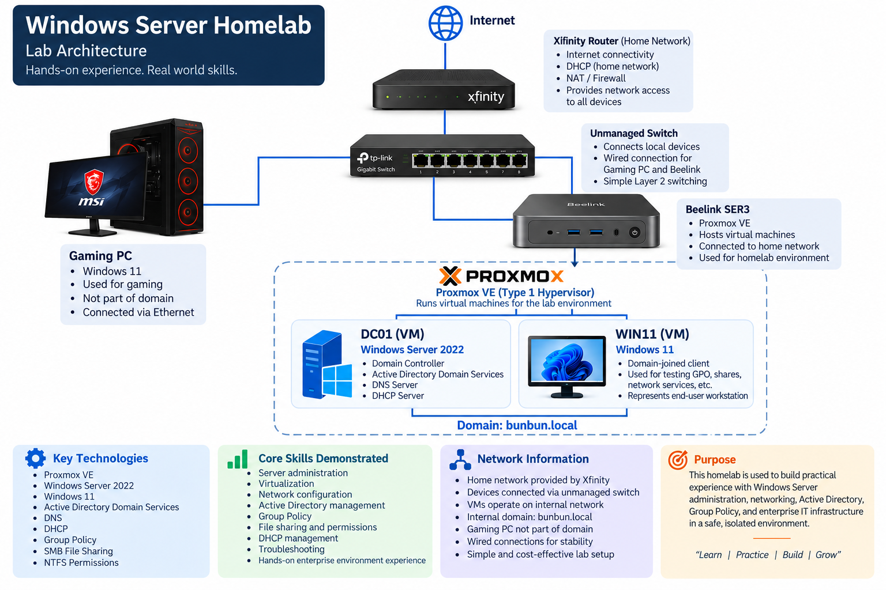

# Windows Server homelab
Windows Server enterprise homelab documenting Active Directory, DNS, DHCP, Group Policy, access control, networking, and troubleshooting.

## Overview

This project documents my hands-on Windows Server homelab built to develop practical experience with Windows Server administration, Active Directory, networking, Group Policy, and enterprise IT infrastructure.

The environment is virtualized using Proxmox VE and includes a Windows Server 2022 domain controller and a Windows 11 domain-joined workstation.

Rather than only following demonstrations, I use the environment to configure services, test configurations, troubleshoot problems, and better understand how Windows domain environments operate.
## Lab Architecture

## Lab Environment

| System | Purpose |
|---|---|
| Proxmox VE | Virtualization platform |
| Windows Server 2022 | Domain Controller (DC01) |
| Windows 11 | Domain-joined client workstation (WIN11) |
| Active Directory Domain Services | Domain and identity management |
| DNS | Domain name resolution |
| DHCP | Automatic IP address assignment |

## Skills & Technologies

- Windows Server 2022
- Windows 11
- Proxmox VE
- Active Directory Domain Services (AD DS)
- DNS
- DHCP
- Organizational Units (OUs)
- User and Group Management
- Group Policy
- Security Filtering
- SMB File Sharing
- NTFS Permissions
- Network Drive Mapping
- DHCP Reservations and Exclusions
- Windows Network Troubleshooting

## Project Documentation

| Project | Documentation |
|---|---|
| Lab Setup & Virtualization | [View Documentation](docs/01-lab-setup.md) |
| Active Directory Domain Services | [View Documentation](docs/02-active-directory.md) |
| Group Policy Management | [View Documentation](docs/03-group-policy.md) |
| File Sharing & NTFS Permissions | [View Documentation](docs/04-file-sharing-permissions.md) |
| DHCP Configuration & Management | [View Documentation](docs/05-dhcp.md) |
