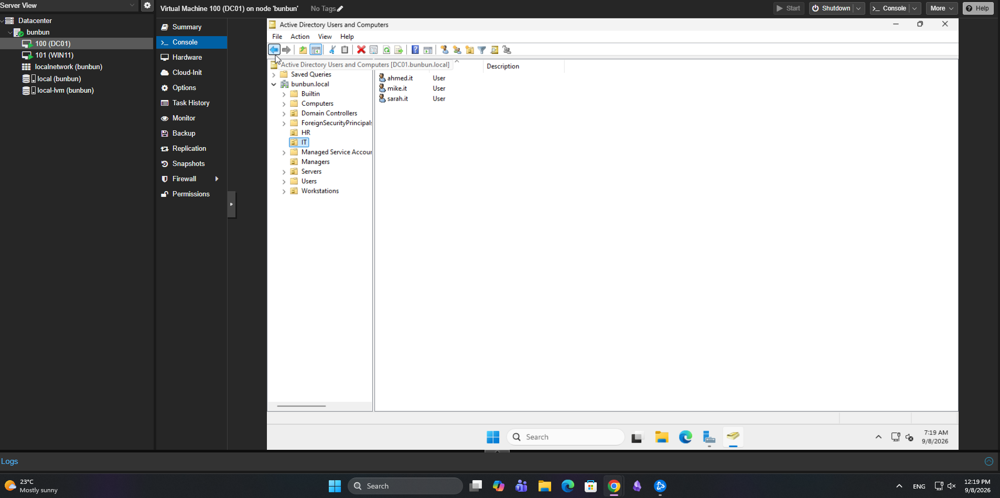
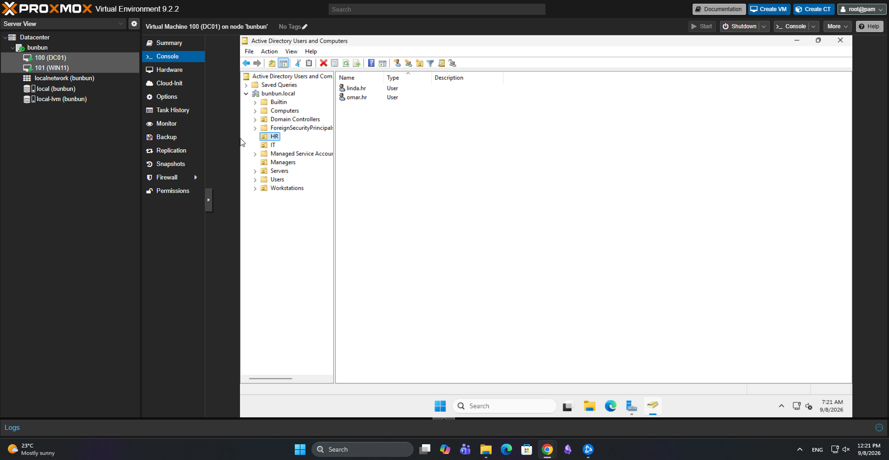

# Active Directory Domain Services

## Objective

Configure a Windows Server 2022 system as a domain controller and create an Active Directory environment for centralized management of users, computers, groups, and organizational units.

## Domain Controller

| Setting | Configuration |
|---|---|
| Server | DC01 |
| Operating System | Windows Server 2022 |
| Domain | bunbun.local |
| Client | WIN11 |

## Active Directory Deployment

I installed the Active Directory Domain Services (AD DS) role on DC01 and promoted the server to a domain controller.

A new Active Directory forest was created using the internal domain:

`bunbun.local`

After the domain controller was configured, the Windows 11 workstation was joined to the domain and used to test domain authentication and configurations.

## Organizational Units

I created Organizational Units (OUs) to separate users and computers into manageable groups.

The environment includes departmental OUs such as:

- HR
- IT
### Active Directory OU Structure

The lab uses separate Organizational Units to organize departmental users and other domain resources. The screenshot below shows the domain structure and the IT OU that contains the domain user accounts.

### HR Department Users

The HR Organizational Unit contains separate domain accounts for testing departmental policies, permissions, and resource access.

Users and computers can be placed into the appropriate OU so that administrative settings and Group Policies can be targeted to specific parts of the organization.

## Users and Groups

I created domain user accounts and security groups using Active Directory Users and Computers.

Example accounts used in the lab include:

- `linda.hr` — HR user
- `ahmed.it` — IT user

These accounts were used to test:

- Domain authentication
- Group membership
- File permissions
- Group Policy application
- Access to departmental resources

## Domain-Joined Workstation

The Windows 11 virtual machine, WIN11, was joined to the `bunbun.local` domain.

This allowed me to test the environment from the perspective of a domain user rather than performing all configuration directly on the server.

## What I Learned

This portion of the homelab provided hands-on experience with:

- Installing Active Directory Domain Services
- Promoting a Windows Server to a domain controller
- Creating an Active Directory forest and domain
- Joining Windows clients to a domain
- Creating and organizing users
- Creating security groups
- Managing Organizational Units
- Testing domain user authentication
- Understanding centralized identity management
