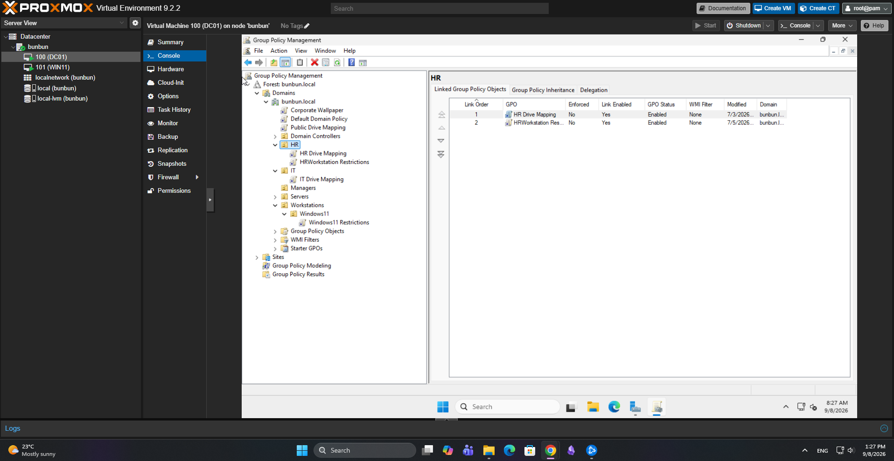
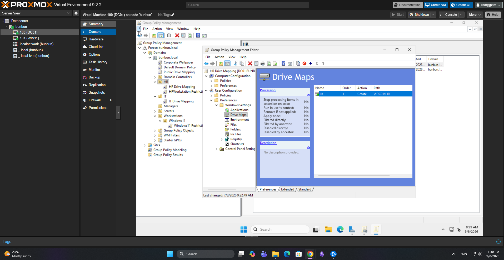

# Group Policy Management

## Objective

Use Group Policy to centrally configure and manage Windows domain users and workstations within the Active Directory environment.

## Group Policy Configuration

I created and tested Group Policy Objects (GPOs) within the `bunbun.local` domain.

Policies were linked to specific Organizational Units so that settings could be applied to selected users rather than the entire domain.

Configurations tested in the lab included:

- Control Panel restrictions
- Corporate desktop wallpaper
- Network drive mapping
- Department-specific policies
- Security filtering
- Group Policy inheritance and precedence
### Group Policy Structure

The lab uses multiple Group Policy Objects linked to specific Organizational Units. This configuration allows policies such as drive mappings and workstation restrictions to be applied to the appropriate users and computers.

The HR OU shown below has separate GPOs for drive mapping and workstation restrictions. Link order was also used to examine how multiple policies are processed.

## Organizational Unit Targeting

Separate Organizational Units were used for departments such as HR and IT.

This allowed policies to be linked to specific OUs and provided hands-on experience in understanding how GPO scope affects users and computers.

## Group Policy Processing

I tested how multiple Group Policies interact within Active Directory.

This included working with:

- Domain-level policies
- OU-level policies
- Inherited policies
- GPO link order
- Policy precedence
- Security filtering

I used `gpupdate /force` on the Windows 11 client to force policy updates while testing configuration changes.
### HR Network Drive Mapping

I configured Group Policy Preferences to automatically map the HR departmental file share for HR users.

The policy creates the `H:` drive and maps it to the shared folder:

`\\DC01\HR`

## Troubleshooting: Wallpaper GPO

One of the most useful troubleshooting exercises occurred while configuring a corporate desktop wallpaper through Group Policy.

### Problem

The wallpaper policy was configured, but the expected wallpaper did not appear for the domain users.

I initially investigated several possible causes, including:

- Image file format
- File naming
- File accessibility
- GPO configuration
- Client policy updates

The image itself could be accessed by the workstation, but the policy still was not applying correctly.

### Root Cause

The issue was eventually traced to **Group Policy security filtering**.

The HR and IT groups that needed the policy were not included in the appropriate security filtering configuration.

### Resolution

I corrected the security filtering so that the intended users/groups had permission for the GPO to apply.

After updating the policy and testing again from the Windows 11 client, the wallpaper policy applied successfully.

## What I Learned

This portion of the lab provided hands-on experience with:

- Creating and linking Group Policy Objects
- Targeting policies through Organizational Units
- Understanding GPO inheritance
- Understanding policy precedence
- Using security filtering
- Forcing and testing Group Policy updates
- Troubleshooting policies that fail to apply
- Identifying configuration problems instead of assuming the policy itself is incorrect
