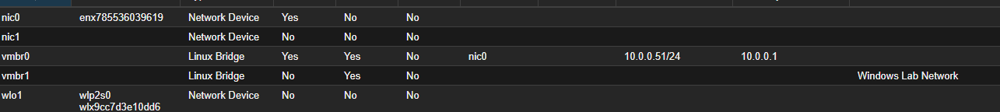
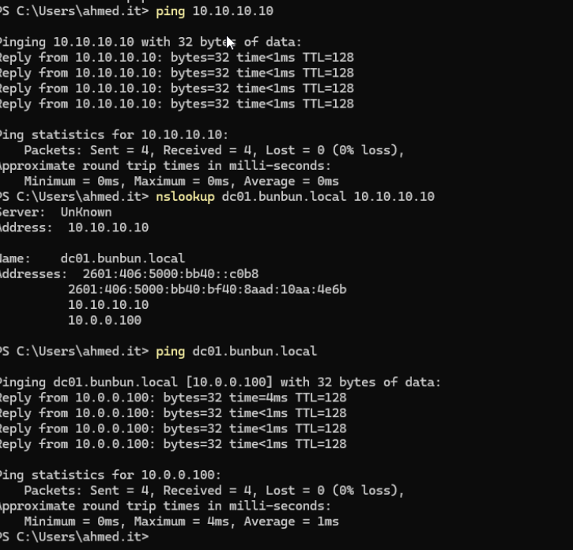
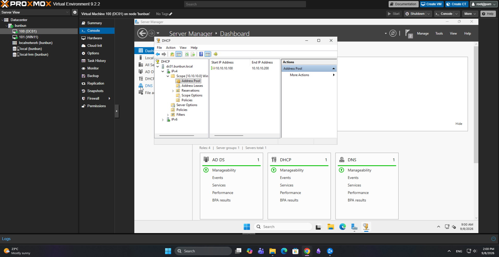
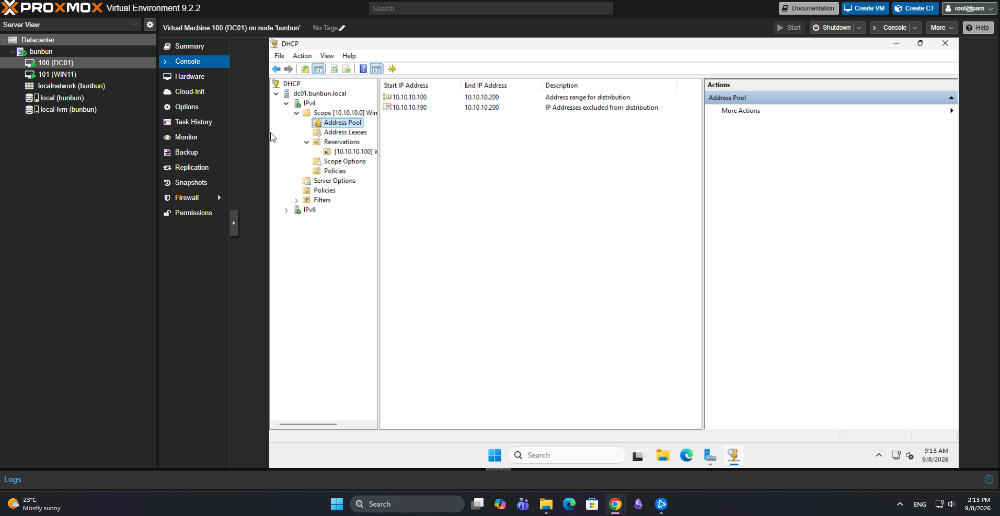
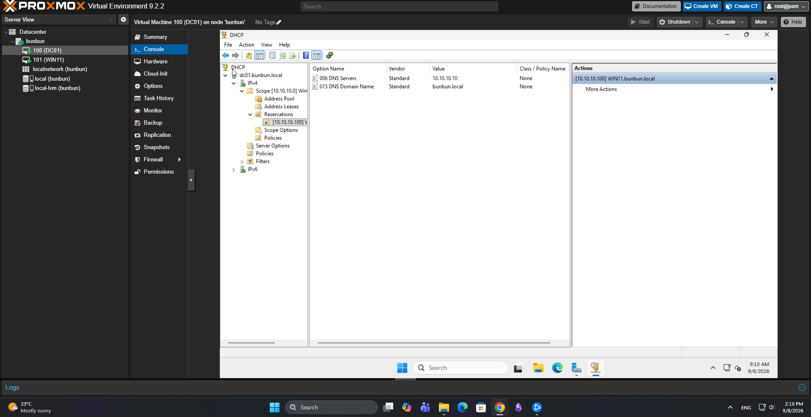
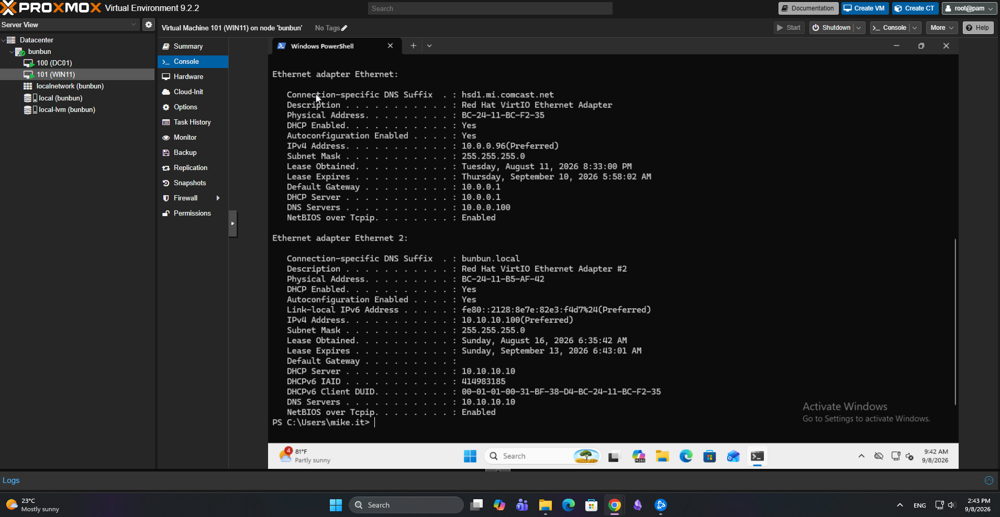

# DHCP Configuration and Management

## Objective

Configure and manage DHCP on Windows Server 2022 to automatically provide network configuration to client devices and gain hands-on experience with DHCP scopes, leases, exclusions, and reservations.
## Network Separation

To safely configure and test Windows Server DHCP without interfering with the DHCP service on my home network, I created a separate virtual network for the Windows Server lab.
### Proxmox Virtual Network

The Proxmox host uses two Linux bridges:

| Bridge | Network | Physical Connection | Purpose |
|---|---|---|---|
| `vmbr0` | `10.0.0.0/24` | `nic0` | Home network and normal network connectivity |
| `vmbr1` | `10.10.10.0/24` lab network | None | Isolated Windows Server lab network |

The screenshot above shows `vmbr0` connected to the physical home network and `vmbr1` configured as the internal Windows lab network with no physical interface attached.
`vmbr0` connects the Proxmox environment to the physical home network and uses the home router at `10.0.0.1` as its gateway.

I created `vmbr1` specifically for the Windows Server lab. Unlike `vmbr0`, it is not attached to a physical network interface and does not have a default gateway. This creates a separate internal virtual network where Windows Server networking services can be configured and tested without affecting devices on the physical home network.
### Dual-Network Lab Design

DC01 and WIN11 use separate network interfaces for the home network and the isolated Windows Server lab network.

The environment contains two IPv4 networks:

- **Home network:** `10.0.0.0/24`
- **Windows Server lab network:** `10.10.10.0/24`

On WIN11:

- **Ethernet** connects to the `10.0.0.0/24` home network and provides the default gateway.
- **Ethernet 2** connects to the isolated `10.10.10.0/24` Windows lab network.

The lab interface intentionally has no default gateway. Normal network and Internet traffic continues to use the home network interface.
### DHCP Separation

The home network and Windows Server lab network use independent DHCP services:

| Network | DHCP Server | Purpose |
|---|---|---|
| `10.0.0.0/24` | `10.0.0.1` | Home network DHCP |
| `10.10.10.0/24` | `10.10.10.10` (DC01) | Windows Server lab DHCP |

During initial configuration, WIN11's lab adapter received a `169.254.x.x` APIPA address because DHCP was not yet available on the isolated lab network.

After configuring and authorizing the DHCP Server role on DC01, WIN11 successfully received `10.10.10.100/24` from the Windows Server DHCP service.

This separation allows me to configure and test Windows Server DHCP without creating a competing DHCP server on my physical home network.
### Connectivity and DNS Verification

From WIN11, I verified direct connectivity to DC01 across the isolated lab network using:

`ping 10.10.10.10`

The test returned four successful replies with 0% packet loss.

I then tested the Windows Server DNS service directly using:

`nslookup dc01.bunbun.local 10.10.10.10`

The DNS query returned addresses associated with both DC01 network interfaces:

- `10.10.10.10` — Windows lab network
- `10.0.0.100` — home network

These tests confirmed that WIN11 could communicate with DC01 across the isolated `10.10.10.0/24` network and successfully query the DNS service running on DC01.

## DHCP Server Configuration

I installed the DHCP Server role on DC01 and authorized the server within Active Directory.

I then created and configured a DHCP scope to provide network configuration to client devices.

The configuration included:

- DHCP scope creation
- IP address range configuration
- DHCP authorization
- Address leases
- Exclusion ranges
- DHCP reservations
### DHCP Address Pool

I configured the DHCP scope with an address pool from `10.10.10.100` through `10.10.10.200` for the `10.10.10.0/24` lab network.

## DHCP Leases

I used the DHCP management console to view active leases and identify devices that had received addresses from the DHCP server.

This provided practical experience in understanding how DHCP tracks address assignments and how leases are associated with client devices rather than individual domain users.

## Exclusion Ranges

I configured DHCP exclusions to prevent selected addresses within the scope from being dynamically assigned.

This demonstrated how portions of an address range can be reserved for devices that require manually managed or otherwise unavailable addresses.
### Configured Exclusion Range

I configured an exclusion from `10.10.10.190` through `10.10.10.200`. These addresses remain inside the scope but are excluded from dynamic DHCP distribution.

## DHCP Reservations

I created DHCP reservations for selected client devices.

Reservations allow a device to continue using DHCP while consistently receiving the same IP address based on its network adapter's MAC address.

This provided experience working with:

- Client IP addresses
- MAC addresses
- DHCP leases
- Reservations
- Address management
### WIN11 Reservation

I created a DHCP reservation for the WIN11 domain workstation so that its network adapter consistently receives `10.10.10.100` from the DHCP server.

## Client Testing

I verified the DHCP configuration from WIN11 using `ipconfig /all` and confirmed that the lab network adapter was configured to use DHCP.

The client received its network configuration from DC01, including the reserved IPv4 address, DHCP server, DNS server, and domain DNS suffix.
### Client Verification

I verified the DHCP configuration from WIN11 using `ipconfig /all`.

The client configuration confirmed:

- DHCP is enabled
- IPv4 address: `10.10.10.100`
- DHCP server: `10.10.10.10`
- DNS server: `10.10.10.10`
- DNS suffix: `bunbun.local`

This confirmed that WIN11 was receiving its network configuration from DC01 through DHCP.

## What I Learned

This portion of the homelab provided hands-on experience with:

- Installing the Windows Server DHCP role
- Authorizing a DHCP server
- Creating and configuring DHCP scopes
- Managing DHCP leases
- Creating exclusion ranges
- Creating DHCP reservations
- Associating reservations with client MAC addresses
- Renewing client network configurations
- Verifying DHCP behavior from both the server and client side
